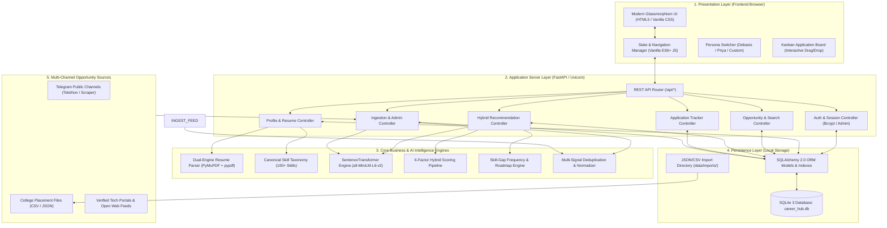
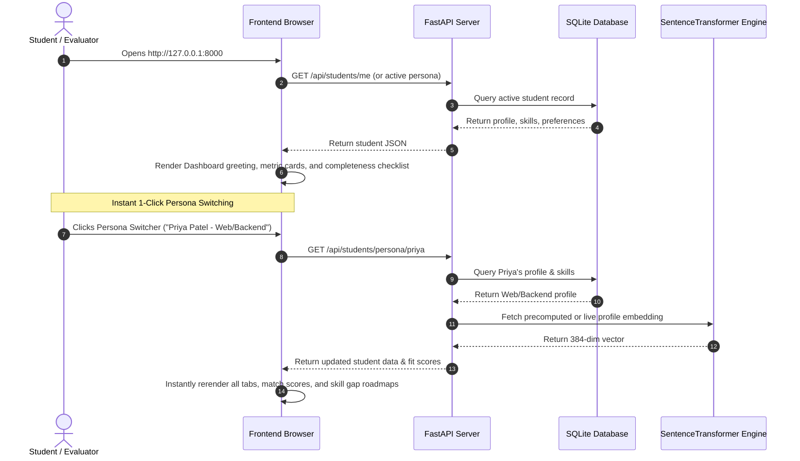
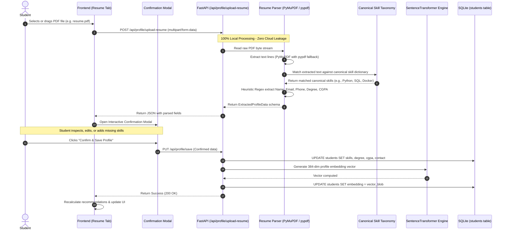
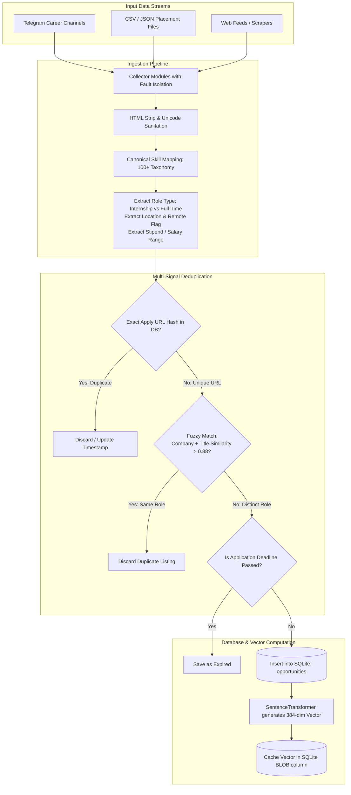
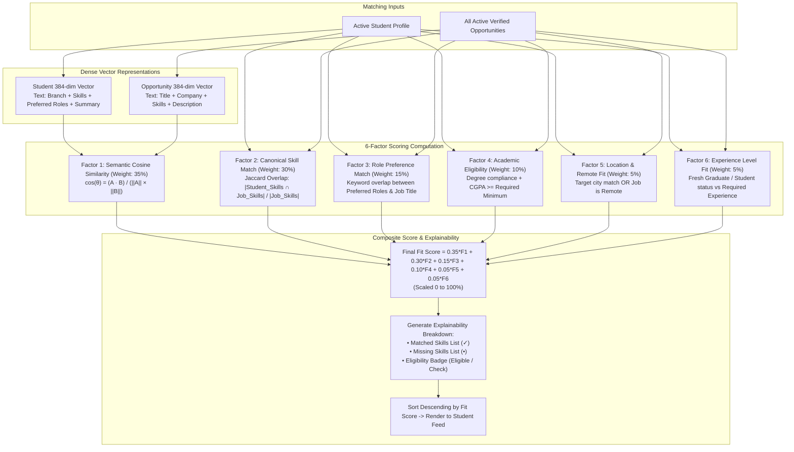
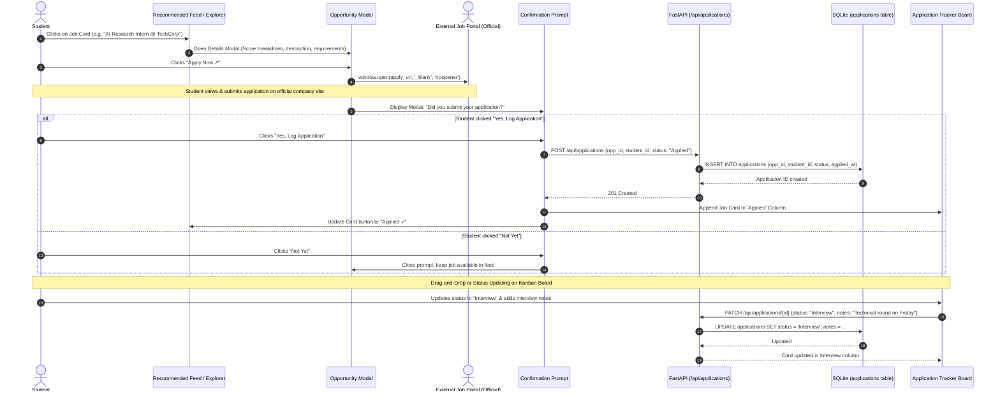
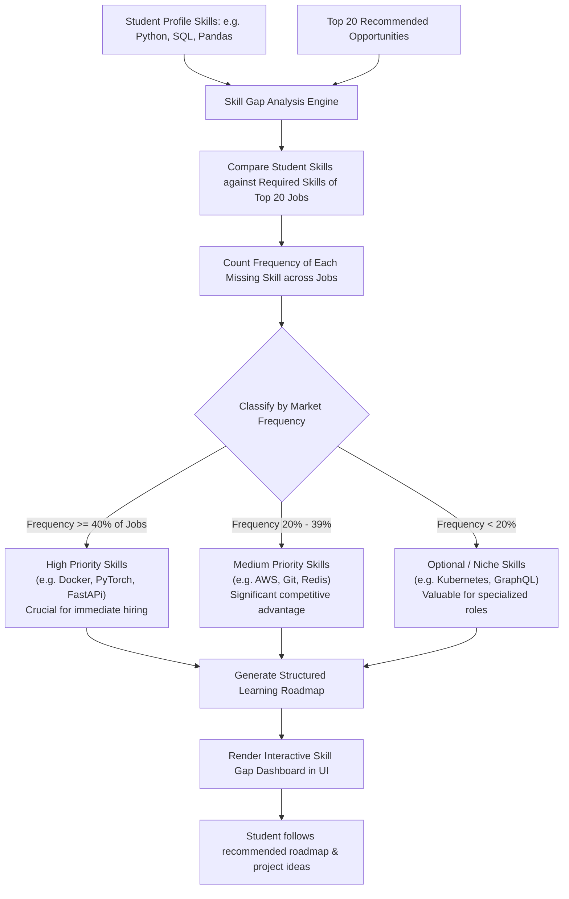
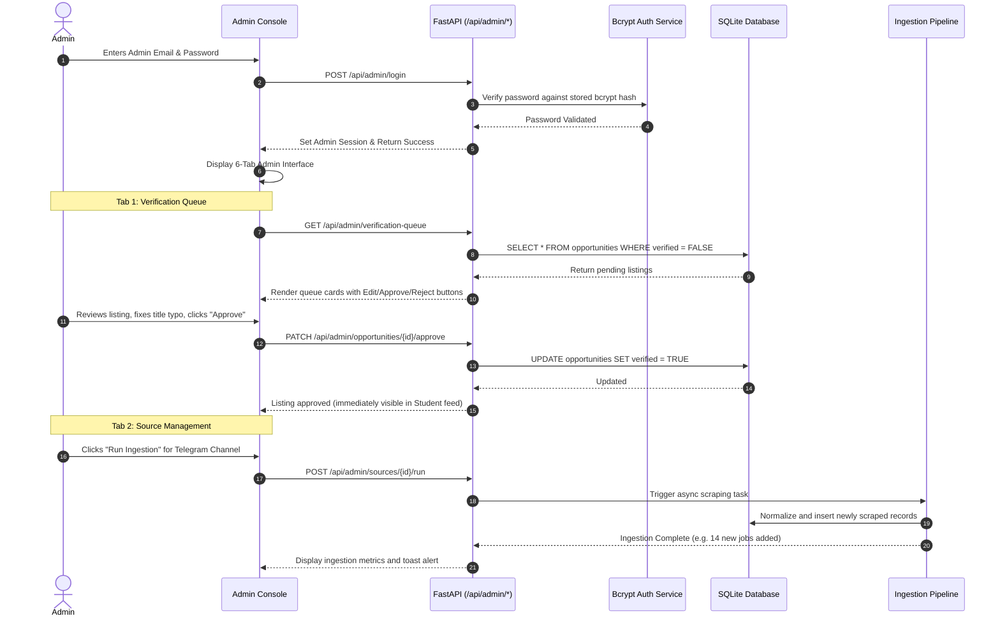

# System Architecture & Complete Flowcharts
## AI-Powered Student Career & Opportunity Hub (`internpilot`)

**Document Version:** 2.0  
**Classification:** System Architecture & Operational Workflows  

---

## 1. High-Level System Architecture

The **AI-Powered Student Career & Opportunity Hub** follows a modern, decoupled layered architecture. All components run locally on the host machine, ensuring complete privacy, zero external API costs, and low latency.



---

## 2. End-to-End Master Workflow (The Big Picture)

The flowchart below illustrates the exact end-to-end journey from the moment a user accesses the platform to job application tracking and career roadmap generation:

```mermaid
flowchart TD
    Start([User Opens Web App in Browser]) --> RouteChoice{Login / Persona Choice}

    %% Authentication / Persona Choice
    RouteChoice -- Quick Evaluator / Demo Persona --> SelectPersona[Click 'Debasis (AI/ML)' or 'Priya (Web)']
    RouteChoice -- Real Student User --> StudentProfile[View / Edit Custom Profile]
    RouteChoice -- Upload New Resume --> UploadPDF[Upload PDF Resume Document]
    RouteChoice -- University Admin --> AdminLogin[Login with Email & Bcrypt Password]

    %% Resume Flow
    UploadPDF --> ParsePDF[PyMuPDF / pypdf extracts raw text]
    ParsePDF --> ExtractEntities[Regex & Canonical Dict extracts Skills, Degree, CGPA, Contact]
    ExtractEntities --> ReviewModal[Interactive Review & Confirmation Modal]
    ReviewModal --> SaveProfile[Save to SQLite Profile Table]
    SaveProfile --> GenStudentVector[Generate 384-dim Student Profile Vector]

    %% Persona Selection Flow
    SelectPersona --> LoadPersona[Load Persona Data & Stored Embedding]
    StudentProfile --> GenStudentVector

    %% Ingestion Branch (Parallel / Periodic)
    subgraph BackgroundIngestion [Opportunity Ingestion & Indexing Pipeline]
        RawSources[Telegram / CSV / Web Feeds] --> IngestRaw[Ingestion Collectors]
        IngestRaw --> Normalize[Normalize Skills, Locations, Stipends]
        Normalize --> Dedup[Multi-Signal Deduplication Check]
        Dedup --> SaveJobDB[(Save Valid Jobs to SQLite)]
        SaveJobDB --> GenJobVector[Generate & Cache 384-dim Job Vectors]
    end

    %% AI Matching Core
    GenStudentVector & GenJobVector --> HybridMatcher[AI Hybrid Recommendation Engine]
    LoadPersona --> HybridMatcher

    subgraph ScoringFactors [6-Factor Scoring Computation]
        HybridMatcher --> F1[1. Vector Cosine Semantic Match: 35%]
        HybridMatcher --> F2[2. Canonical Skill Overlap Jaccard: 30%]
        HybridMatcher --> F3[3. Role Preference Alignment: 15%]
        HybridMatcher --> F4[4. Academic Degree / CGPA Match: 10%]
        HybridMatcher --> F5[5. Location & Remote Fit: 5%]
        HybridMatcher --> F6[6. Experience Level Fit: 5%]
    end

    F1 & F2 & F3 & F4 & F5 & F6 --> CompositeScore[Calculate Final Fit Score: 0 - 100%]
    CompositeScore --> RankedFeed[Render Ranked Recommendation Feed]

    %% User Interaction Flow
    RankedFeed --> FilterFeed[Adjust Match Threshold Slider e.g. 70%+]
    FilterFeed --> ClickDetails[Click 'Details & Match' Modal]
    ClickDetails --> InspectScore[Inspect 6-Factor Bar Breakdown & Missing Skills]

    InspectScore --> ActionChoice{User Decision}
    ActionChoice -- Bookmark for Later --> SaveBookmark[Save to 'Saved Opportunities' Tab]
    ActionChoice -- Apply Now --> ClickApply[Click 'Apply Now' Button]

    %% Application Flow
    ClickApply --> OpenExternal[Open Official Portal in New Tab: window.open]
    OpenExternal --> ConfirmPrompt{Modal: 'Did you submit your application?'}
    ConfirmPrompt -- Yes, Log It --> CreateAppRecord[POST /api/applications -> Status: 'Applied']
    ConfirmPrompt -- Not Yet --> KeepOpen[Leave Job in Feed]

    CreateAppRecord --> KanbanBoard[Display on Real-Time Kanban Board]
    KanbanBoard --> ProgressLifecycle[Drag / Update to Under Review, Interview, Offer, Rejected]

    %% Growth Flow
    RankedFeed --> SkillGap[Skill Gap Engine Analyzes Top 20 Opportunities]
    SkillGap --> ClusterGaps[Cluster Missing Skills: High / Medium / Optional]
    ClusterGaps --> Roadmap[Render Actionable Learning Roadmap]

    %% Admin Branch
    AdminLogin --> AdminSuite[Admin Dashboard & Verification Queue]
    AdminSuite --> ReviewQueue[Approve / Reject / Edit Newly Scraped Jobs]
    ReviewQueue --> SaveJobDB
```

---

## 3. Step-by-Step Flow 1: User Onboarding & Persona Switching

This flow shows how students and evaluators immediately interact with the system upon opening the web dashboard.



### Detailed Sequence Breakdown:
1. **User Request**: User opens the URL. The single-page app checks `localStorage` or defaults to the primary student persona.
2. **Profile Retrieval**: Frontend makes an asynchronous `GET` request to retrieve the student's name, degree, branch, skills, and preferences.
3. **Completeness Verification**: The frontend computes the completeness percentage (e.g., `85%`) based on filled fields.
4. **Persona Switch Action**: Evaluators can click the top-right persona buttons. The application instantly refreshes the active state, re-ranks the opportunity feed, and recalculates missing skill roadmaps without reloading the browser page.

---

## 4. Step-by-Step Flow 2: Resume Upload, Parsing & Embedding

This is the exact pipeline when a student uploads a PDF resume.



### Exact Details of the Parsing Phase:
- **PDF Extraction**: Text is extracted using PyMuPDF's C-accelerated parser. If a user runs on a machine without compiled C binaries, `pypdf` seamlessly extracts the text stream.
- **Regex Extraction**:
  - Name is parsed from the top lines, excluding header labels and URLs.
  - Email is verified with RFC regex.
  - Degrees (`B.Tech`, `M.Tech`, `MCA`, `BCA`) and graduation years (`2024–2030`) are extracted.
- **Skill Normalization**: Raw resume mentions like `"py"`, `"reactjs"`, or `"k8s"` are normalized into canonical names (`Python`, `React`, `Kubernetes`).
- **Student Control**: Rather than blindly writing to the database, an interactive modal appears allowing the student to review, edit, or append missing projects and skills before final submission.

---

## 5. Step-by-Step Flow 3: Opportunity Ingestion & Indexing

How job listings enter the system, get normalized, deduplicated, and prepared for matching.



### Exact Deduplication Strategy:
- **Primary Check**: Exact SHA-256 hash of `apply_url`. If identical, it is rejected immediately.
- **Secondary Check**: Fuzzy string ratio of `company` + `title`.
  - If Company is identical and Title Levenshtein ratio $> 0.88$, it is flagged as duplicate.
  - **Protection Guard**: Distinct roles (e.g., "Frontend Intern" vs "Backend Intern") at the same company are guaranteed never to merge.

---

## 6. Step-by-Step Flow 4: The 6-Factor Hybrid AI Matching Engine

This is the exact mathematical and algorithmic recommendation flow that powers the **Recommended For You** feed.



### Why the 6-Factor Algorithm Outperforms Single-Signal Matchers:
1. **No Keyword Traps**: Pure keyword matchers fail if the student writes "Deep Learning" but the job writes "Machine Learning". Vector embeddings resolve this semantically.
2. **No Pure Vector Hallucinations**: Pure vector similarity can recommend a senior role to a fresher simply because the domain text looks similar. Our algorithm verifies degree eligibility and graduation year.
3. **Explainable by Design**: Every score comes with a breakdown showing exactly which factors contributed to the final percentage.

---

## 7. Step-by-Step Flow 5: Applying to a Job & Kanban Tracking

How a student safely applies to a listing and tracks it through the full application lifecycle.



---

## 8. Step-by-Step Flow 6: Skill Gap Analysis & Learning Roadmaps

How the platform identifies what skills a student is missing and constructs actionable roadmaps.



---

## 9. Step-by-Step Flow 7: Administrative Auditing & Source Management

How university administrators or placement coordinators control sources and audit newly scraped listings.



---

## 10. Architectural Summary & Resilience Guarantees

1. **Complete Decoupling**: Frontend, Backend REST API, AI Intelligence, and Ingestion subsystems operate independently.
2. **Offline Resilience**: Once dependencies and the lightweight transformer model are cached locally, the entire application operates seamlessly without an active internet connection.
3. **Data Integrity**: SQLite ACID transactions and multi-signal deduplication ensure that opportunities remain accurate, non-redundant, and resilient against system restarts.
4. **Deterministic Explainability**: Every match percentage is derived from verifiable mathematical equations rather than black-box cloud LLM predictions.
